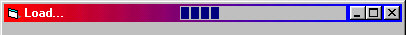



## ProgressBar in Titlebar

### Description

Shows you how to put a ProgressBar into the Titlebar of your program.

Great for loading a form. Enjoy! AND VOTE FOR ME!
 
### More Info
 

             |
---                |---
**Submitted On**   |2000-09-06 17:54:14
**By**             |[Druid Developing](https://github.com/Planet-Source-Code/PSCIndex/blob/master/ByAuthor/druid-developing.md)
**Level**          |Intermediate
**User Rating**    |4.5 (54 globes from 12 users)
**Compatibility**  |VB 5\.0, VB 6\.0
**Category**       |[Custom Controls/ Forms/  Menus](https://github.com/Planet-Source-Code/PSCIndex/blob/master/ByCategory/custom-controls-forms-menus__1-4.md)
**World**          |[Visual Basic](https://github.com/Planet-Source-Code/PSCIndex/blob/master/ByWorld/visual-basic.md)
**Archive File**   |[CODE\_UPLOAD9681962000\.zip](https://github.com/Planet-Source-Code/druid-developing-progressbar-in-titlebar__1-11298/archive/master.zip)

### API Declarations

Some.

